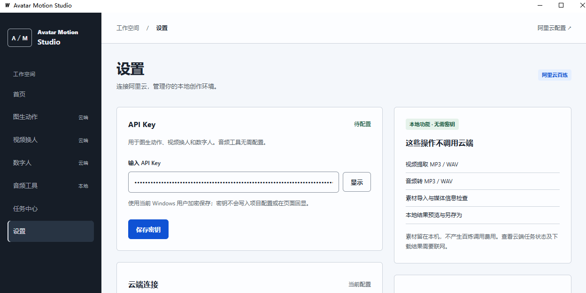
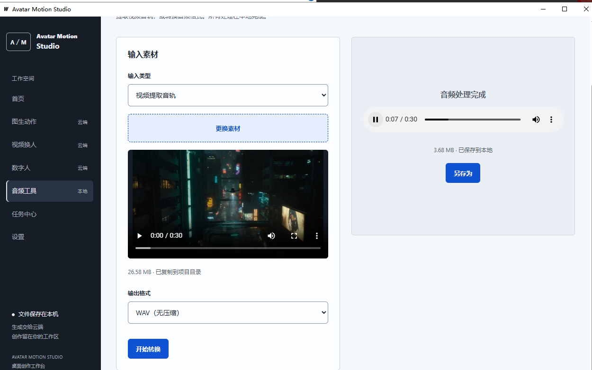

# Avatar Motion Studio

面向人物视频与配音创作的 Windows 桌面工具，支持图生动作、视频换人、数字人、Qwen 语音合成，以及本地音频提取与转换。

**当前版本：v0.2.0 · Windows x64 · Windows 10 / 11**

[下载完整 Windows 包](https://github.com/haozheyu/avatar-motion-studio/releases/latest) · [问题反馈](https://github.com/haozheyu/avatar-motion-studio/issues)

## 1. 获取程序

推荐在 **Releases** 下载 `Avatar-Motion-Studio-v0.2.0-windows-x64.zip`，完整解压后运行。包内已附带 FFmpeg 与 FFprobe，无需自己配置默认工具路径。

也可以克隆仓库：

```bash
git clone https://github.com/haozheyu/avatar-motion-studio.git
cd avatar-motion-studio
```

**请保留 EXE 与 tools 的相对位置，不要只下载或移动主程序。** 不需要安装 Go、Node.js、Python 或 ComfyUI。

```text
avatar-motion-studio/
├── avatar-motion-studio-windows-amd64.exe
├── README.md
├── LICENSE
├── SHA256SUMS.txt
├── image/
│   ├── 保存云端配置.png
│   └── 视频音频提取.png
└── tools/
    └── ffmpeg/
        └── windows/
            ├── ffmpeg.exe
            ├── ffprobe.exe
            ├── LICENSE
            └── README.txt
```

## 2. 第一次启动

1. 将完整文件夹解压至可写目录，例如 `D:\AvatarMotionStudio\`。
2. 双击 `avatar-motion-studio-windows-amd64.exe`，不要在压缩包内直接运行。
3. 首次启动自动创建 `config/local.json` 和 `data/`。
4. 本地音频工具可以直接使用；云端功能先按下一节配置 Key。

界面依赖 **Microsoft Edge WebView2 Runtime**。若提示缺少运行时，请从 [Microsoft 官方页面](https://developer.microsoft.com/en-us/microsoft-edge/webview2/) 安装 Evergreen Runtime 后重启程序。

同一时间只运行一个实例。配置和数据位置以 EXE 所在文件夹为准，与快捷方式的“起始位置”无关。

## 3. 哪些功能需要联网？

| 功能 | 输入 → 输出 | 执行位置 | 需要 Key |
| --- | --- | --- | --- |
| 图生动作 | 人物图片 + 动作参考视频 → 动作视频 | 阿里云百炼 | 是 |
| 视频换人 | 原视频 + 目标人物图片 → 替换人物的视频 | 阿里云百炼 | 是 |
| 数字人 | 人物图片 + 人声音频 → 数字人视频 | 阿里云百炼 | 是 |
| 语音合成 | 稿子 + 音色 → WAV 配音 | 阿里云百炼 | 是 |
| 视频提取 MP3 / WAV | 带音轨的视频 → 音频 | 本地 FFmpeg | 否 |
| 音频转 MP3 / WAV | 音频 → MP3 / WAV | 本地 FFmpeg | 否 |
| 素材导入、媒体检查、本地预览与另存为 | 本机文件处理 | 本机 | 否 |

云端功能的上传、提交、查询与结果下载需要联网。视频生成会上传所选素材；语音合成会发送稿子。费用、额度和模型权限以你自己的百炼账户为准。

本地音频工具不上传素材，也不产生百炼调用费用。已下载的音视频可离线播放。当前没有本地 Wan / Avatar / TTS 模型推理。

## 4. 配置阿里云

进入 **设置 → API Key**，填写自己的 Key，点击 **保存密钥**。



- Key 使用当前 Windows 用户的 DPAPI 加密保存，不写入普通 JSON，也不回显已保存内容。
- 保存成功代表本地配置成功，尚未验证云端权限。
- 有生成任务运行时不能更换 Key。
- 换电脑或 Windows 用户后，需要重新配置自己的 Key。

默认使用北京地域公共 DashScope 地址：`https://dashscope.aliyuncs.com/api/v1`。

如果使用专属 API Host，先关闭程序，再编辑 `config/local.json` 的 `bailian.base_url` 和 `bailian.region`，填写与 Key 匹配的 **DashScope 地址，以 `/api/v1` 结尾**。不要使用 OpenAI 兼容的 `/compatible-mode/v1` 地址。修改配置后重启。

默认模型：

| 功能 | 配置项 | 模型 |
| --- | --- | --- |
| 图生动作 | `bailian.models.motion` | `wan2.2-animate-move` |
| 视频换人 | `bailian.models.replace` | `wan2.2-animate-mix` |
| 数字人 | `bailian.models.avatar` | `wan2.2-s2v` |
| 语音合成 | `tts.model` | `qwen3-tts-flash` |

旧配置没有 `tts` 时，会兼容加载默认语音模型。当前语音音色列表适用于 `qwen3-tts-flash` 和 `qwen3-tts-flash-2025-11-27`，其他模型不保证兼容。

高级用法：`AVATAR_STUDIO_CONFIG` 可指定配置文件绝对路径；Key 也可从配置中的 `bailian.api_key_env` 环境变量读取，界面保存的加密 Key 优先。

## 5. 图生动作、视频换人、数字人

1. 在侧栏选择功能。
2. 选择人物图片，再选择动作参考视频、原视频或人声音频。
3. 选择服务模式或分辨率，确认界面显示的素材要求。
4. 点击 **上传素材并生成**，提交云端生成任务。
5. 在 **任务中心** 等待完成，预览结果并 **另存为**。

素材建议：图片尽量清晰、单人、少遮挡；动作视频选择人物明显、动作连续、镜头稳定的片段；数字人音频以清晰人声为主。

视频换人会尽量保留原动作、背景与构图，实际效果取决于模型和素材，不保证完全一致。

## 6. Qwen 非实时语音合成

1. 打开 **语音合成**，编写或粘贴配音稿。
2. 搜索并选择内置音色，共 48 项；选择朗读语种。
3. 点击 **合成语音**。
4. 在任务中心试听并另存 WAV；需要 MP3 时，使用音频工具转换。

单次最多 **600 字符**，标点也计入，长稿请手动分段。草稿自动保存在本机。合成沿用已有阿里云 Key 和 DashScope 地址，提交前会检查 FFprobe 是否可用。

非实时请求中断后不会自动重复提交，以免重复计费。语音合成输出可用于数字人，但导入前仍需满足数字人页面的时长、大小和格式限制。

[官方音色列表](https://www.alibabacloud.com/help/zh/model-studio/qwen-tts-voice-list) · [接口说明](https://www.alibabacloud.com/help/zh/model-studio/qwen-tts-api)

## 7. 视频音频提取与音频转换



打开 **音频工具**，选择“视频提取音轨”或“音频格式转换”，导入文件，选择 MP3 / WAV，点击 **开始转换**。完成后可以试听并另存为。

处理全部在本机完成。视频没有音轨时无法提取声音；格式转换不会为无声视频生成声音。

## 8. FFmpeg 与工具目录

完整包已包含 Windows FFmpeg / FFprobe，默认路径为：

```text
tools/ffmpeg/windows/ffmpeg.exe
tools/ffmpeg/windows/ffprobe.exe
```

除了音频工具，云端功能的素材检查与下载结果校验也需要这些工具。请随主程序一起保留 `tools` 文件夹。

如果旧配置指向其他电脑的路径，可关闭程序后在 `config/local.json` 中改回：

```json
"media": {
  "ffmpeg_path": "tools/ffmpeg/windows/ffmpeg.exe",
  "ffprobe_path": "tools/ffmpeg/windows/ffprobe.exe"
}
```

相对路径按 `config` 目录的上一级解析。也可填写自己的绝对路径，JSON 中建议使用 `/`，例如 `D:/MediaTools/bin/ffprobe.exe`。

## 9. 任务中心与结果

视频任务依次经历：创建 → 上传 → 提交 → 生成 → 下载校验 → 完成。语音任务无需上传素材，经历：创建 → 合成 → 下载校验 → 完成。

任务中心可查看状态、错误、历史结果，预览和另存为。成功结果由 Go 自动下载到本机，不把临时云端 URL 当作最终文件保存。

请保持程序运行和网络连接直至下载完成。取消本地任务不保证云端停止执行或停止计费。若请求结果不确定，请先查看百炼控制台，避免短时间重复提交。

## 10. 数据与升级

运行后创建的个人数据结构：

```text
config/
└── local.json
data/
├── studio.db
├── credentials/
└── projects/
    └── default/
        ├── inputs/
        └── outputs/
```

升级前等待任务结束并关闭程序，备份 `config/` 和 `data/`。下载新版后更新主 EXE 与 `tools/`，保留个人配置和数据。通过 Git 获取的用户可以在关闭程序后执行 `git pull`。

发布 ZIP 不包含 Key、个人配置、素材或数据库。分享程序时不要把运行后生成的 `config/`、`data/` 一起打包。

## 11. 常见问题

| 现象 | 检查与处理 |
| --- | --- |
| 双击没有窗口 | 检查已有实例、WebView2、目录写入权限和 JSON 配置格式。 |
| 未找到 FFprobe / FFmpeg | 确认完整解压，检查工具位置；旧配置中的绝对路径可能来自另一台电脑。 |
| 文件内容与素材类型不符或媒体损坏 | 检查所选类型和文件是否完整。旧版本也可能把工具缺失误报成此提示；新版已区分工具错误。 |
| 没配 Key 能否读取本地素材？ | 可以。本地读取与音频转换不依赖阿里云 Key，但需要工具文件齐全。 |
| 鉴权失败或没有模型权限 | 核对 Key、地域、DashScope 地址及百炼账户权限。 |
| `InvalidVideo.NoHuman` | 模型没有识别到符合要求的人体，换用单人、清晰、少遮挡、少切镜的片段。 |
| 一直生成中 | 检查任务中心、网络与百炼控制台，不要反复提交。 |
| 无法提取声音 | 确认原视频有音轨，格式转换无法恢复不存在的声音。 |
| 另存为失败 | 当前版本避免覆盖已有文件，请换一个新文件名。 |

## 12. 版本与反馈

v0.2.0 新增 Qwen 非实时语音合成，修正媒体工具错误提示，提供包含 `tools` 的完整 Windows 包。接口、状态处理、本地音频流程测试和 Windows 构建已验证；尚未完成所有模型与素材组合的真实生成效果验证。

仅提供 Windows 10 / 11 x64 版本，暂不提供 ARM64、macOS 或 Linux 包。

[提交 Issue](https://github.com/haozheyu/avatar-motion-studio/issues) 时请说明版本、Windows 版本、操作步骤和错误码，避免公开 Key 或私人素材。

## 许可证与第三方组件

主项目许可证见 [LICENSE](LICENSE)。随包 FFmpeg 工具来自 gyan.dev 的 9.0.1 essentials Windows 构建，其 GPL v3 许可证、上游源码链接与构建信息保留在 [tools/ffmpeg/windows/LICENSE](tools/ffmpeg/windows/LICENSE) 和 [README.txt](tools/ffmpeg/windows/README.txt)，不适用主项目的 MIT 许可声明。

`SHA256SUMS.txt` 列出主程序与两个媒体工具的 SHA-256，可用 PowerShell `Get-FileHash -Algorithm SHA256 <文件路径>` 核对。
